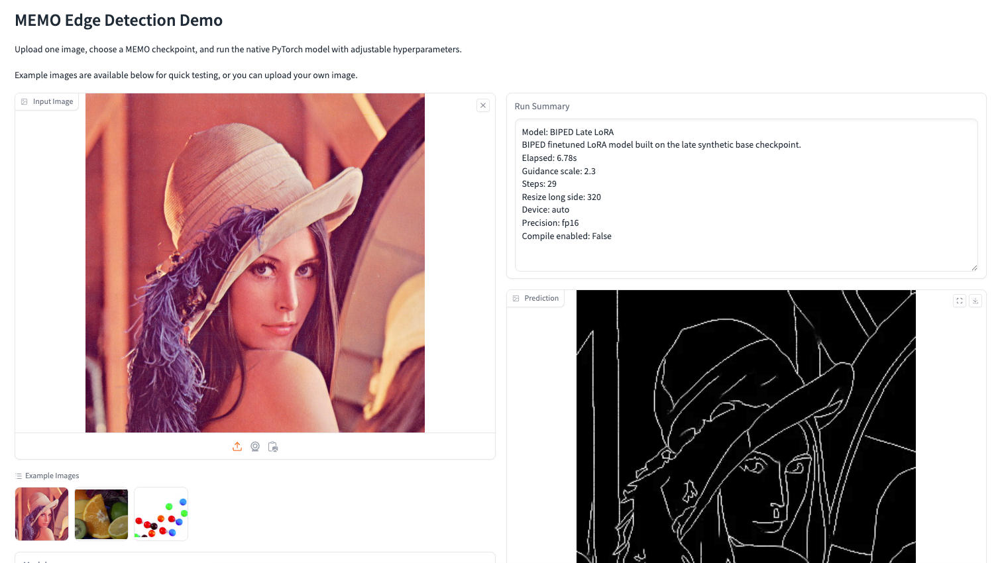

# MEMO Edge Detection
The code for Masked Edge Prediction Model (CVPR 2026)

## Table of Contents
- [Introduction](#memo-edge-detection)
- [Clone the repo and install the dependencies](#clone-the-repo-and-install-the-dependencies)
- [Prepare the dataset](#prepare-the-dataset)
    - [Create your own synthetic edge dataset](#create-your-own-synthetic-edge-dataset)
    - [Download synthetic edge dataset](#or-download-synthetic-edge-dataset)
- [Use trained Model](#use-trained-model)
- [Model Downloader](#model-downloader)
- [Interactive Demos](#interactive-demos)
    - [PyTorch Notebook Example](#pytorch-notebook-example)
    - [Gradio Web Demo](#gradio-web-demo)
- [ONNX Runtime Inference](#onnx-runtime-inference)
    - [Notebook Example](#notebook-example)
    - [Recommended Runtime](#recommended-runtime)
    - [Export ONNX Models](#export-onnx-models)
    - [Run ONNX Runtime Inference](#run-onnx-runtime-inference)
    - [First Run Note](#first-run-note)
- [Train model on synthetic dataset](#to-train-model-on-synthetic-dataset)
- [Finetune on pretrained model](#to-finetune-on-pretrained-model)

## Clone the repo and install the dependencies
```bash
git clone https://github.com/cplusx/MEMO_Edge_Detection.git
pip install -r requirements.txt
cd opencv_edge
bash dld.sh
```

## Prepare the dataset
You can choose to create the synthetic edge dataset by yourself or download the ones that we have processed


### Create your own synthetic edge dataset
Have your images downloaded and run the script (remember to change the image/save dir and the number of images to process)
```bash
python sam_mask_to_edge.py --dataset_name [IMAGE_DIR] --save_dir [SAVE_DIR] --start_idx 0 --num_images 10
```
NOTE: you will need to install [SAM2](https://github.com/facebookresearch/sam2) to run this script

### (Or) Download synthetic edge dataset
[Download link](https://huggingface.co/datasets/cplusx/MEMO_synthetic_edges/tree/main)


## Use trained Model
| Model | Variant | Notes | Link |
|---|---|---|---|
| Trained on synthetic dataset | Earlier epoch | Prediction is less crisp, but has a slightly higher benchmarking score when finetuned. | [link](https://huggingface.co/cplusx/MEMO_laion_pretraining/tree/main/epoch%3D0079.ckpt/checkpoint) |
| Trained on synthetic dataset | Later epoch | Prediction is crisper, but has a slightly lower benchmarking score when finetuned. | [link](https://huggingface.co/cplusx/MEMO_laion_pretraining/tree/main/epoch%3D0279.ckpt/checkpoint) |
| Finetuned on BSDS | Using earlier-epoch base model | — | [link](https://huggingface.co/cplusx/MEMO_BSDS_ft_early/tree/main/checkpoint) |
| Finetuned on BSDS | Using later-epoch base model | — | [link](https://huggingface.co/cplusx/MEMO_BSDS_ft_late/tree/main/checkpoint) |
| Finetuned on BIPEDv2 | Using later-epoch base model | — | [link](https://huggingface.co/cplusx/MEMO_BIPED_ft/tree/main/checkpoint) |

### How to use
Download the trained model and run the following script

NOTE: the synthetic data pretrained model should use config `configs/binary/discrete_v2data_binary_dinov2.yaml` and the finetuned models should use `configs/discrete_BSDS_finetune/binary_lora_default.yaml` or `configs/discrete_BIPED_finetune/binary_lora_default.yaml`.
```bash
python edge_prediction.py \
    --test_folder [PATH_TO_TEST_FOLDER] \
    --save_folder [PATH_TO_SAVE_FOLDER] \
    --config_file [PATH_TO_CONFIG_FILE] \
    --model_path [PATH_TO_MODEL] \
    --guidance_scale 1.4 \
    --max_steps 20
```

For LoRA finetuned checkpoints, also pass the synthetic pretrained checkpoint used as the base model:

```bash
python edge_prediction.py \
    --test_folder [PATH_TO_TEST_FOLDER] \
    --save_folder [PATH_TO_SAVE_FOLDER] \
    --config_file configs/discrete_BSDS_finetune/binary_lora_default.yaml \
    --model_path [PATH_TO_LORA_FINETUNED_MODEL] \
    --base_model_path pretrained_models/MEMO_synthetic_late/mp_rank_00_model_states.pt \
    --guidance_scale 1.4 \
    --max_steps 20
```

## Model Downloader

The checkpoint downloader can list, download, and resolve local paths for all published checkpoints.

```bash
python download_checkpoints.py --list
python download_checkpoints.py --model synthetic-late
python download_checkpoints.py --model bsds-late --model biped-late
python download_checkpoints.py --all
python download_checkpoints.py --model synthetic-late --output-root /path/to/checkpoints
python download_checkpoints.py --model bsds-late --print-path
python download_checkpoints.py --model bsds-late --print-path --output-root /path/to/checkpoints
```

Downloader notes:

- By default, checkpoints are downloaded under `pretrained_models`.
- Use `--model` one or more times to download selected checkpoints.
- Use `--all` to download every registered checkpoint.
- Use `--output-root` to place the checkpoint folders under a custom root directory.
- Use `--print-path` to print the resolved local checkpoint path without downloading.
- Use `--overwrite` to redownload files that already exist.

## Interactive Demos

The repository includes two interactive native PyTorch demos.

Both demos can download a public example image automatically, so they do not require a local `edge_data` folder.

### PyTorch Notebook Example

- [pytorch_runtime_example.ipynb](pytorch_runtime_example.ipynb)

This notebook:

- lists the available native PyTorch model presets
- downloads one public example image into `experiments/demo_examples`
- runs a single-image PyTorch inference pass
- displays and saves the result inline in `experiments/pytorch_notebook_demo`

### Gradio Web Demo

Launch the web UI with:

Run this inside your own prepared Python environment:

```bash
python gradio_app.py
```

The Gradio UI supports:

- image upload
- example images downloaded from public URLs
- model selection across the prepared MEMO checkpoints
- automatic background checkpoint download when the selected model is not available locally
- controllable hyperparameters including guidance scale, steps, resize long side, device, and precision

Interface preview:



## ONNX Runtime Inference

The repository also includes an ONNX Runtime deployment path for faster inference.

Detailed deployment notes are available in [deployment_onnx/README.md](deployment_onnx/README.md).

### Notebook Example

The quickest way to try the ONNX pipeline is the notebook:

- [deployment_onnx/onnx_runtime_example.ipynb](deployment_onnx/onnx_runtime_example.ipynb)

This notebook saves example outputs in `experiments/onnx_notebook_demo`.

### Recommended Runtime

Generate the runtime recommendation for the current machine:

Run this inside your own prepared Python environment:

```bash
python deployment_onnx/print_runtime_recommendation.py \
    --write_json deployment_onnx/runtime_recommendation.json
```

### Export ONNX Models

Run this inside your own prepared Python environment:

```bash
python deployment_onnx/export_onnx.py \
    --config_file configs/binary/discrete_v2data_binary_dinov2.yaml \
    --model_path pretrained_models/MEMO_synthetic_late/mp_rank_00_model_states.pt \
    --output_dir onnx_models/memo_synthetic_late_fp16 \
    --height 352 \
    --width 512 \
    --precision fp16_direct
```

For LoRA finetuned checkpoints, add `--base_model_path`:

```bash
python deployment_onnx/export_onnx.py \
    --config_file configs/discrete_BSDS_finetune/binary_lora_default.yaml \
    --model_path pretrained_models/MEMO_BSDS_ft_late/mp_rank_00_model_states.pt \
    --base_model_path pretrained_models/MEMO_synthetic_late/mp_rank_00_model_states.pt \
    --output_dir onnx_models/memo_bsds_late_lora_fp16 \
    --height 352 \
    --width 512 \
    --precision fp16_direct
```

Main output files:

- [onnx_models/memo_synthetic_late_fp16/dino_encoder_fp16.onnx](onnx_models/memo_synthetic_late_fp16/dino_encoder_fp16.onnx)
- [onnx_models/memo_synthetic_late_fp16/memo_denoiser_fp16.onnx](onnx_models/memo_synthetic_late_fp16/memo_denoiser_fp16.onnx)

You can also download pre-exported ONNX models directly from Hugging Face:

- `cplusx/MEMO_onnx_runtime`

Download one model folder into the local `onnx_models` directory:

```bash
huggingface-cli download cplusx/MEMO_onnx_runtime \
    memo_synthetic_late_fp16/dino_encoder_fp16.onnx \
    memo_synthetic_late_fp16/memo_denoiser_fp16.onnx \
    --repo-type model \
    --local-dir onnx_models
```

Download all exported ONNX folders:

```bash
huggingface-cli download cplusx/MEMO_onnx_runtime \
    --repo-type model \
    --local-dir onnx_models
```

Available ONNX folders in the Hugging Face repository:

- `memo_synthetic_early_fp16`
- `memo_synthetic_late_fp16`
- `memo_bsds_early_lora_fp16`
- `memo_bsds_late_lora_fp16`
- `memo_biped_late_lora_fp16`

### Run ONNX Runtime Inference

Run this inside your own prepared Python environment:

```bash
python deployment_onnx/run_onnx_inference.py \
    --test_folder edge_data/BSDS500/BSDS500/data/images/test \
    --save_folder experiments/bsds_test_onnx \
    --dino_encoder_path onnx_models/memo_synthetic_late_fp16/dino_encoder_fp16.onnx \
    --denoiser_path onnx_models/memo_synthetic_late_fp16/memo_denoiser_fp16.onnx \
    --guidance_scale 1.4 \
    --max_steps 20 \
    --resize_long_side 320
```

### First Run Note

The first ONNX Runtime run can be much slower than later runs.

This is expected. Later runs are usually much faster after the cache is created.

### To train model on synthetic dataset
```bash
python train.py --config_file configs/binary/discrete_v2data_binary_dinov2.yaml
```
Remember to modify the `image_dir` and `edge_dir` in the config file

### To finetune on pretrained model
```bash
python train.py --config_file configs/discrete_BIPED_finetune/binary_lora_default.yaml
```

There are several configurations to modify in the config file

`init_weights`: change to the pretrained weights

`root_dir`: change to the root of the BIPEDv2 dataset, check the `edge_datasets.edge_datasets.BIPEDv2` for details.