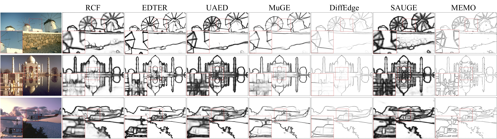
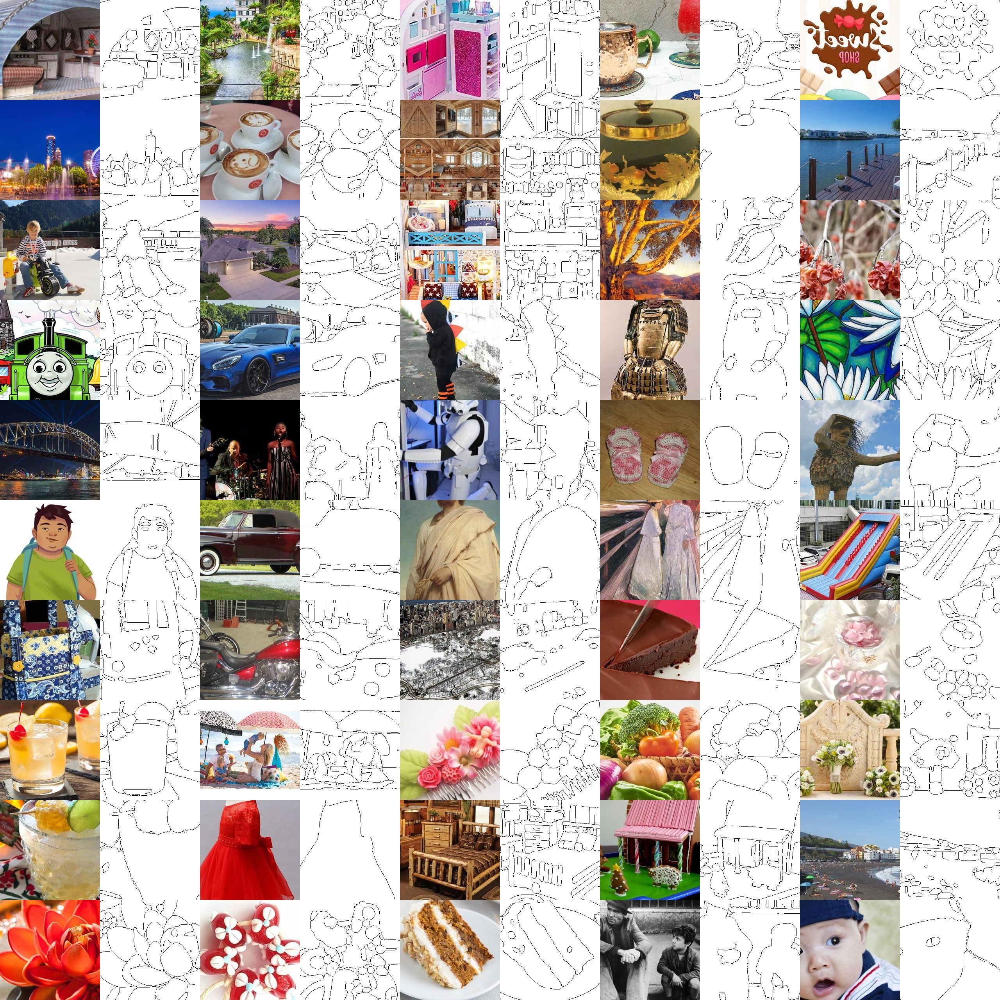

# MEMO Edge Detection
The code for Masked Edge Prediction Model (CVPR 2026)

## Table of Contents
- [Introduction](#memo-edge-detection)
- [Clone the repo and install the dependencies](#clone-the-repo-and-install-the-dependencies)
- [Prepare the dataset](#prepare-the-dataset)
    - [Create your own synthetic edge dataset](#create-your-own-synthetic-edge-dataset)
    - [Download synthetic edge dataset](#or-download-synthetic-edge-dataset)
- [Use trained Model](#use-trained-model)
- [Train model on synthetic dataset](#to-train-model-on-synthetic-dataset)
- [Finetune on pretrained model](#to-finetune-on-pretrained-model)

## Clone the repo and install the dependencies
```bash
git clone https://github.com/cplusx/MEMO_Edge_Detection.git
pip install -r requirements.txt
cd opencv_edge
bash dld.sh
```

## Prepare the dataset
You can choose to create the synthetic edge dataset by yourself or download the ones that we have processed


### Create your own synthetic edge dataset
Have your images downloaded and run the script (remember to change the image/save dir and the number of images to process)
```bash
python sam_mask_to_edge.py --dataset_name [IMAGE_DIR] --save_dir [SAVE_DIR] --start_idx 0 --num_images 10
```
NOTE: you will need to install [SAM2](https://github.com/facebookresearch/sam2) to run this script

### (Or) Download synthetic edge dataset
[Download link](https://huggingface.co/datasets/cplusx/MEMO_synthetic_edges/tree/main)


## Use trained Model
| Model | Variant | Notes | Link |
|---|---|---|---|
| Trained on synthetic dataset | Earlier epoch | Prediction is less crisp, but has a slightly higher benchmarking score when finetuned. | [link](https://huggingface.co/cplusx/MEMO_laion_pretraining/tree/main/epoch%3D0079.ckpt/checkpoint) |
| Trained on synthetic dataset | Later epoch | Prediction is crisper, but has a slightly lower benchmarking score when finetuned. | [link](https://huggingface.co/cplusx/MEMO_laion_pretraining/tree/main/epoch%3D0279.ckpt/checkpoint) |
| Finetuned on BSDS | Using earlier-epoch base model | — | [link](https://huggingface.co/cplusx/MEMO_BSDS_ft_early/tree/main/checkpoint) |
| Finetuned on BSDS | Using later-epoch base model | — | [link](https://huggingface.co/cplusx/MEMO_BSDS_ft_late/tree/main/checkpoint) |
| Finetuned on BIPEDv2 | Using later-epoch base model | — | [link](https://huggingface.co/cplusx/MEMO_BIPED_ft/tree/main/checkpoint) |

### How to use
Download the trained model and run the following script

NOTE: the synthetic data pretrained model should use config `configs/binary/discrete_v2data_binary_dinov2.yaml` and the finetuned models should use `configs/discrete_BSDS_finetune/binary_lora_default.yaml` or `configs/discrete_BIPED_finetune/binary_lora_default.yaml`.
```bash
python edge_prediction \
    --test_folder [PATH_TO_TEST_FOLDER] \
    --save_folder [PATH_TO_SAVE_FOLDER] \
    --config_file [PATH_TO_CONFIG_FILE] \
    --model_path [PATH_TO_MODEL] \
    --guidance_scale 1.4 \
    --max_steps 20
```

### To train model on synthetic dataset
```bash
python train.py --config_file configs/binary/discrete_v2data_binary_dinov2.yaml
```
Remember to modify the `image_dir` and `edge_dir` in the config file

### To finetune on pretrained model
```bash
python train.py --config_file configs/discrete_BIPED_finetune/binary_lora_default.yaml
```

There are several configurations to modify in the config file

`init_weights`: change to the pretrained weights

`root_dir`: change to the root of the BIPEDv2 dataset, check the `edge_datasets.edge_datasets.BIPEDv2` for details.